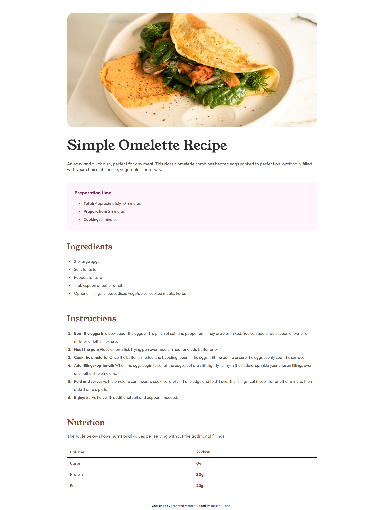
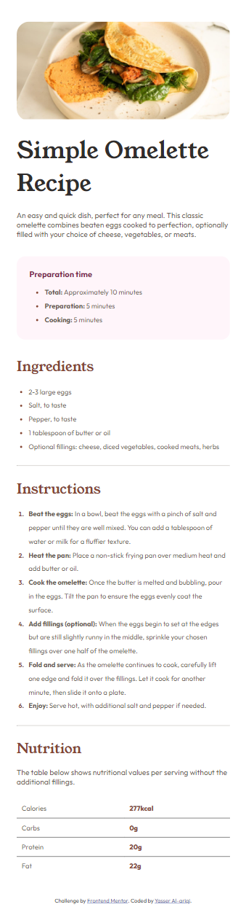

## Overview

The Recipe Page project is a well-structured and visually appealing recipe page designed to showcase a simple omelette recipe. This project highlights essential web development skills, including HTML, CSS, and responsive design. It provides users with clear instructions, ingredient lists, and nutritional information in a user-friendly format.

### Live Version

- **Live Site URL**: [View the live version here](https://yasseresam.github.io/Front-End-Mentor-Recipe-page/)

### Features

- **Header Section**: Displays a high-quality image of the omelette and the main recipe title.
- **Preparation Section**: Lists the time required for preparation and cooking.
- **Ingredients Section**: Provides a detailed list of ingredients required for the recipe.
- **Instructions Section**: Outlines step-by-step instructions for preparing the omelette.
- **Nutrition Section**: Presents nutritional information per serving in a table format.
- **Footer**: Includes attribution to Frontend Mentor and the project author.

### Tools Used

- **HTML5**: For semantic markup and structuring content.
- **CSS3**: For styling and layout, including Flexbox and CSS Grid for responsive design.
- **Responsive Design**: Achieved using media queries to ensure the page looks great on various devices.
- **Google Fonts**: Used for custom typography with `Outfit` and `Young Serif` fonts.
- **Image Optimization**: Ensured fast loading times by optimizing images.

**Technologies:**

- **Semantic HTML5 Markup**
- **CSS Custom Properties**
- **Flexbox**
- **CSS Grid**
- **Mobile-First Workflow**
- **Google Fonts**

### Screenshots

**Desktop View:**
 <!-- Make sure to replace this path with the actual path to your screenshot -->

**Phone View:**
 <!-- Make sure to replace this path with the actual path to your screenshot -->

This project serves as an example of clean and efficient web design, focusing on usability and responsiveness.
